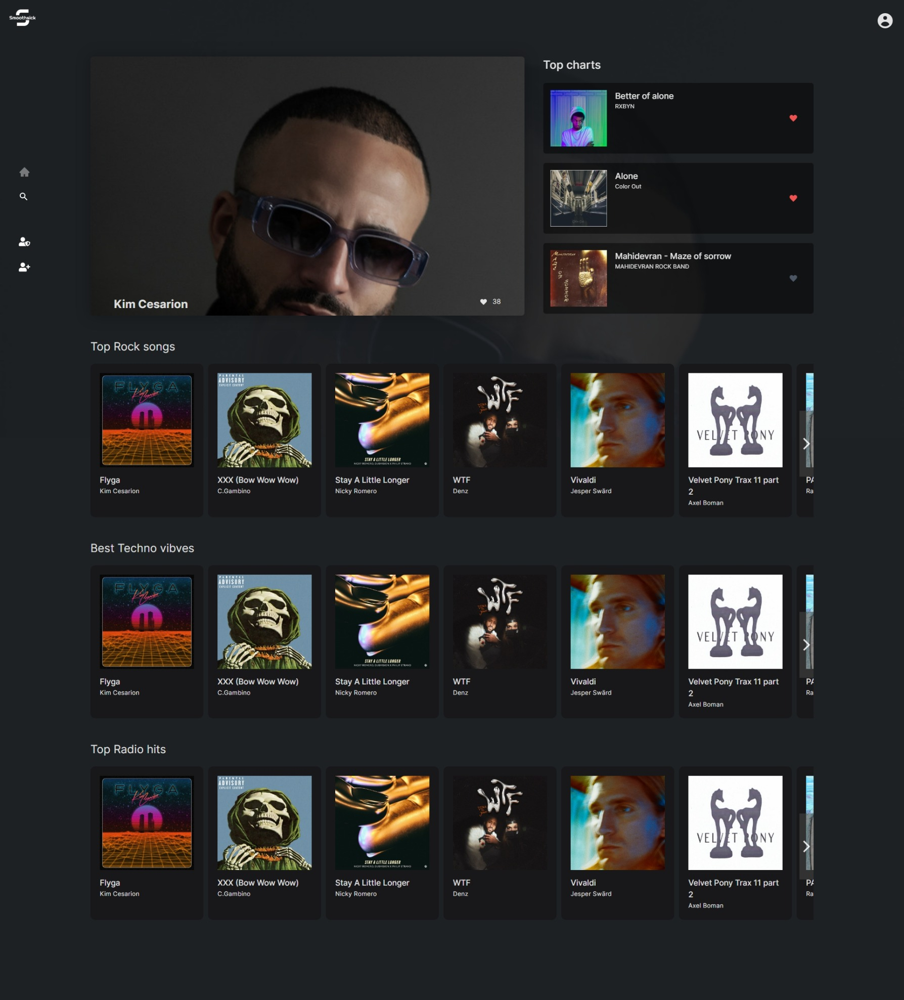
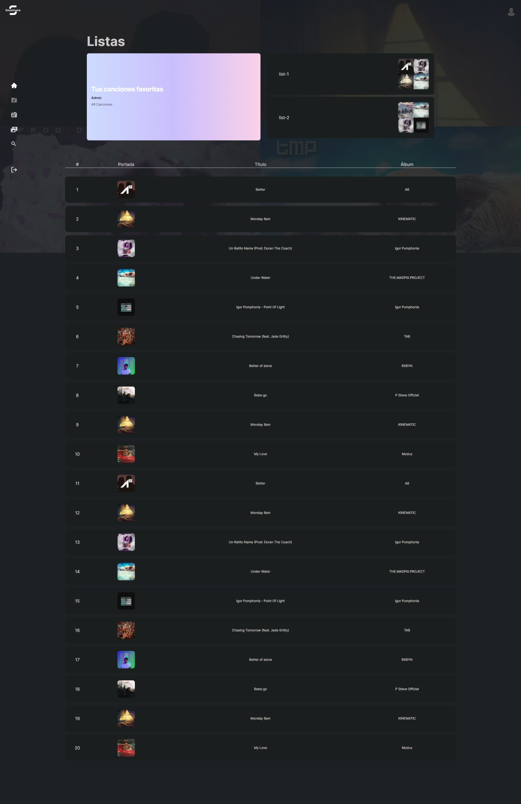

# Smoothsick

This project is based on the page <a href="https://deezer.com">Deezer</a> and mocks the music platform implemented by this page, trying with this to improve my knowledge of react and another related libraries.\
 

 

 

 

 

 

 

 

This web application uses on <u><i>frontend</i></u>:

<b><ul>

  <li>React v18.2</li>
  <li>React router v6.9 for the route management</li>
  <li>Tailwind v3.2.7</li>
  <li>React-uauth/google for google authentication</li>
</ul></b>

On the <u><i>backend:</i></u>

<b><ul>

  <li>Node.js</li>
  <li>Express.js</li>
  <li>MongoDb</li>
</ul></b>
 

You can visit this page through this link ✈️ <a>https://smoothsick.arcprojects.es</a>\
 

👩‍🚀 I hope you enjoy it! 🚀

 
(●'◡'●) (●'◡'●) (●'◡'●)
